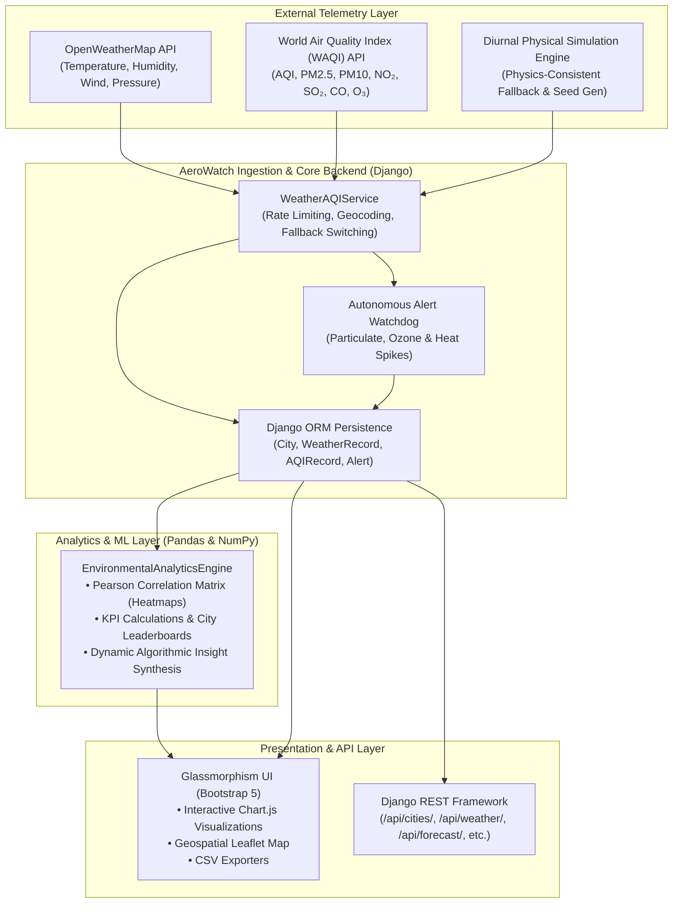

# 🌤️ AeroWatch — Weather & Air Quality Monitoring, Analysis & Environmental Intelligence Platform

[](https://python.org)
[](https://djangoproject.com)
[](https://www.django-rest-framework.org/)
[](https://pandas.pydata.org/)
[](https://chartjs.org)
[](https://leafletjs.com)
[](LICENSE)

> **AeroWatch** is an enterprise-grade environmental monitoring and statistical analytics platform engineered with Python, Django, Pandas, NumPy, and modern glassmorphic web visualization. It merges live meteorological forces with atmospheric pollutant concentrations, delivering Pearson correlation models, 7-day multi-variable forecasts, geospatial Leaflet mapping, autonomous early warning dispatches, and full RESTful APIs.

---

## 📑 Table of Contents
1. [Architecture & System Overview](#-architecture--system-overview)
2. [Key Platform Features](#-key-platform-features)
3. [Exploratory Data Analysis & Statistical Intelligence](#-exploratory-data-analysis--statistical-intelligence)
4. [REST API Documentation](#-rest-api-documentation)
5. [Tech Stack](#-tech-stack)
6. [Quick Start & Local Setup](#-quick-start--local-setup)
7. [Automated Verification & Testing](#-automated-verification--testing)
8. [Production Deployment](#-production-deployment)
9. [Project Structure](#-project-structure)
10. [License](#-license)

---

## 🏛️ Architecture & System Overview



---

## 🌟 Key Platform Features

| Feature | Description |
| :--- | :--- |
| **Live Executive Dashboard** | Real-time overview of global environmental KPIs, cleanest/most polluted stations, active warnings, and quick station switcher. |
| **Meteorological Tracking** | Deep dive into temperature, feels-like index, atmospheric pressure, relative humidity, wind speed & direction, and UV index. |
| **Air Quality Intelligence** | EPA/WHO standard AQI classifications with six pollutant breakdowns: $PM_{2.5}$, $PM_{10}$, $NO_2$, $SO_2$, $CO$, and $O_3$. |
| **Dual-Axis Correlation** | Synchronized time-series plotting temperature and wind dynamics directly against air quality index curves. |
| **7-Day Trajectory Forecast** | Physics-derived and synoptic predictive modeling forecasting maximum/minimum temperatures and expected AQI progression. |
| **Pearson Correlation Matrix** | Exploratory data analysis heatmap examining bivariate statistical dependencies ($r \in [-1.0, +1.0]$). |
| **Interactive Leaflet Map** | Dark-matter geospatial mapping rendering color-coded AQI dials across global coordinates with interactive telemetry popups. |
| **Multi-City Comparison** | Pairwise station benchmarking calculating delta divergence across atmospheric metrics and particulate loads. |
| **Early Warning Dispatch** | Automated threshold trigger logging critical pollution spikes ($PM_{2.5} > 90 \mu g/m^3$, $AQI > 200$, heat waves). |
| **Station Registry Management**| Administrative panel to register new global stations, auto-geocode coordinates, and trigger synchronous telemetry pulls. |
| **CSV Research Exports** | One-click raw and merged dataset exports ready for offline machine learning pipelines and statistical research. |

---

## 🔬 Exploratory Data Analysis & Statistical Intelligence

AeroWatch integrates a dedicated data analysis engine built with **Pandas** and **NumPy**:

- **Pearson Correlation Heatmaps:** Evaluates correlation matrices across $T$, $RH$, $P$, $U_{wind}$, $AQI$, $PM_{2.5}$, $PM_{10}$, and $NO_2$.
- **Wind Dispersion Dynamics:** Quantifies how elevated wind speeds accelerate particulate advection and pollutant clearance ($r_{wind, AQI} < -0.3$).
- **Inversion & Humidity Retention:** Analyzes moisture-driven particulate stagnation during high-humidity periods ($r_{RH, PM2.5} > +0.25$).
- **Dynamic NLP Insights:** Synthesizes actionable textual summaries detailing regional variances, cleanest stations, and health advisories.

---

## 🚀 REST API Documentation

AeroWatch exposes a fully documented RESTful API:

### Endpoints Overview

| Method | Endpoint | Description | Query Parameters |
| :--- | :--- | :--- | :--- |
| `GET` | `/api/cities/` | List all monitored stations | None |
| `POST`| `/api/cities/` | Register new station | `{"name": "Zurich", "country": "CH"}` |
| `POST`| `/api/cities/{id}/refresh/` | Ingest live observation | None |
| `GET` | `/api/weather/` | Historical weather observations | `?city_id=1` |
| `GET` | `/api/air-quality/` | Historical AQI & pollutant logs | `?city_id=1` |
| `GET` | `/api/alerts/` | List active early warning alerts | None |
| `GET` | `/api/forecast/` | 7-Day weather & AQI forecast | `?city=1` or `?city=Tokyo` |
| `GET` | `/api/analytics/` | Pearson matrix & summary KPIs | None |

### Sample API Response (`GET /api/forecast/?city=Tokyo`)

```json
{
  "city": "Tokyo",
  "country": "Japan",
  "forecast": [
    {
      "date": "2026-09-11",
      "day_name": "Friday",
      "condition": "Scattered Clouds",
      "temp_max": 28.4,
      "temp_min": 19.8,
      "temp_avg": 24.1,
      "aqi": 38,
      "category": "Good",
      "rain_prob": 20
    }
  ]
}
```

---

## 💻 Tech Stack

- **Backend Framework:** Django 4.2+ / Django REST Framework (DRF)
- **Data Analysis & Modeling:** Pandas 2.2+, NumPy 1.26+
- **Database:** SQLite (default development) / PostgreSQL ready
- **External APIs:** OpenWeatherMap API, World Air Quality Index (WAQI / aqicn.org)
- **Frontend & Visualization:** Bootstrap 5, Chart.js 4.4, Leaflet.js 1.9, FontAwesome 6
- **Architecture:** MVT + Modular Service/Analytics Architecture

---

## ⚡ Quick Start & Local Setup

### 1. Clone the Repository
```bash
git clone https://github.com/kondamadugu18/weather-and-air-quality-monitering-analysis-system-.git
cd weather-and-air-quality-monitering-analysis-system-
```

### 2. Create and Activate Virtual Environment
```bash
# Windows
python -m venv venv
venv\Scripts\activate

# Linux / macOS
python3 -m venv venv
source venv/bin/activate
```

### 3. Install Dependencies
```bash
pip install -r requirements.txt
```

### 4. Configure Environment Variables (Optional)
Copy `.env.example` to `.env` and insert your free API keys:
```env
OPENWEATHER_API_KEY=your_openweather_api_key
WAQI_API_KEY=your_waqi_api_token
SECRET_KEY=your_django_secret_key
DEBUG=True
```
*(Note: If API keys are omitted, AeroWatch will automatically run in high-fidelity physics-consistent simulation mode.)*

### 5. Apply Database Migrations
```bash
python manage.py migrate
```

### 6. Run the Development Server
```bash
python manage.py runserver 8000
```
Visit **[http://127.0.0.1:8000](http://127.0.0.1:8000)** in your browser.

---

## 🧪 Automated Verification & Testing

AeroWatch includes an end-to-end automated verification test suite:

```bash
python test_aerowatch.py
```

### Test Suite Execution Output:
```
======================================================================
AEROWATCH — AUTOMATED TEST SUITE & VERIFICATION
======================================================================

[1/5] Testing Model Persistence...
  [OK] City 'Tokyo, Japan' validated (ID: 8)

[2/5] Testing WeatherAQIService Ingestion & Simulation...
  [OK] Ingested Weather: 22.6 C, Condition: Scattered Clouds
  [OK] Ingested AQI: 64 (Moderate), PM2.5: 35.5 ug/m3

[3/5] Testing 7-Day Forecast Engine...
  [OK] Forecast generated 7 days: Friday to Thursday

[4/5] Testing Pandas Environmental Analytics Engine...
  [OK] Summary KPIs calculated: 46 total observations
  [OK] Pearson correlation variables: ['Temperature', 'Humidity', 'Pressure', 'Wind Speed', 'Aqi', 'Pm25', 'Pm10', 'No2']
  [OK] City rankings computed for 8 stations
  [OK] Algorithmic insights derived: 4 finding(s)

[5/5] Testing Web Views & REST Endpoints (HTTP 200)...
  [OK] [200] Dashboard View                           (/)
  [OK] [200] Weather View                             (/weather/)
  [OK] [200] Air Quality View                         (/air-quality/)
  [OK] [200] Combined Analysis View                   (/combined/)
  [OK] [200] 7-Day Forecast View                      (/forecast/)
  [OK] [200] Analytics & Pearson Correlation View     (/analytics/)
  [OK] [200] City Comparison View                     (/comparison/)
  [OK] [200] Leaflet Geospatial Map View              (/map/)
  [OK] [200] Alerts & Dispatch Feed View              (/alerts/)
  [OK] [200] City Management View                     (/cities/)
  [OK] [200] Data Export View                         (/download/)
  [OK] [200] About & Architecture View                (/about/)
  [OK] [200] DRF API Cities List                      (/api/cities/)
  [OK] [200] DRF API Weather List                     (/api/weather/)
  [OK] [200] DRF API AQI List                         (/api/air-quality/)
  [OK] [200] DRF API Alerts List                      (/api/alerts/)
  [OK] [200] DRF API 7-Day Forecast                   (/api/forecast/?city=8)
  [OK] [200] DRF API Analytics                        (/api/analytics/)

======================================================================
ALL 18/18 VIEWS & ENGINE COMPONENTS PASSED SUCCESSFULLY!
======================================================================
```

---

## 🚢 Production Deployment

### Railway / Render / Fly.io / Heroku Deployment Checklist:
1. Ensure `requirements.txt` contains `gunicorn` and `whitenoise`.
2. Add `Procfile`:
   ```procfile
   web: gunicorn weatheraqi.wsgi --log-file -
   ```
3. Set environment variables on your cloud provider:
   - `SECRET_KEY` = `(secure-random-key)`
   - `DEBUG` = `False`
   - `ALLOWED_HOSTS` = `.railway.app,.onrender.com,yourdomain.com`
4. Run migrations during release phase: `python manage.py migrate`.

---

## 📂 Project Structure

```
weather-and-air-quality-monitering-analysis-system-/
├── manage.py                     # Django administrative entrypoint
├── requirements.txt              # Production Python dependencies
├── test_aerowatch.py             # E2E test verification suite
├── README.md                     # Project documentation & architecture
├── .env.example                  # Environment configuration template
├── .gitignore                    # Git exclusion rules
├── db.sqlite3                    # Database persistence
│
├── weatheraqi/                   # Django Project Configuration
│   ├── __init__.py
│   ├── settings.py               # Global settings, DRF, templates, static
│   ├── urls.py                   # Root URL dispatcher
│   ├── wsgi.py                   # WSGI entrypoint for web servers
│   └── asgi.py                   # ASGI entrypoint for async pipelines
│
├── monitor/                      # Core Environmental Application
│   ├── __init__.py
│   ├── models.py                 # City, WeatherRecord, AQIRecord, Alert
│   ├── services.py               # Live OWM/WAQI API & diurnal simulation
│   ├── analytics.py              # Pandas & NumPy EDA & Pearson engine
│   ├── serializers.py            # DRF ModelSerializers
│   ├── views.py                  # Web view controllers (11 pages)
│   ├── api_views.py              # REST API ViewSets & endpoints
│   ├── urls.py                   # Application routing
│   └── admin.py                  # Django Admin models registration
│
├── templates/                    # HTML5 Templates
│   ├── base.html                 # Glassmorphic base layout & sidebar
│   └── monitor/
│       ├── dashboard.html        # Executive monitoring dashboard
│       ├── weather.html          # Weather telemetry & dials
│       ├── air_quality.html      # AQI indices & 6-pollutant breakdown
│       ├── combined_analysis.html# Dual-axis cross-metric curves
│       ├── forecast.html         # 7-day predictive trajectory
│       ├── analytics.html        # Pearson matrix & EDA leaderboard
│       ├── city_comparison.html  # Pairwise station benchmarking
│       ├── map_view.html         # Leaflet.js geospatial map
│       ├── alerts.html           # Active warning dispatch log
│       ├── city_management.html  # Station registry & CRUD
│       ├── data_download.html    # CSV export portal
│       └── about.html            # System architecture & API specs
│
└── static/                       # Static Assets
    ├── css/
    │   └── custom.css            # Dark glassmorphism design system
    └── js/
        └── charts.js             # Chart.js helper library
```

---

## 📄 License

This project is licensed under the MIT License — see the [LICENSE](LICENSE) file for details.
